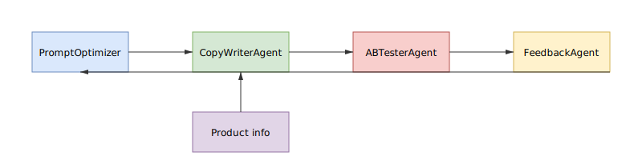

# Multi-agent product copy example

This directory contains a sample script showing how to use the OpenAI agent SDK
to orchestrate multiple agents. The `product_copy_agents.py` script demonstrates
how marketing copy can be generated, evaluated via a simulated A/B test and the
results fed back to improve future prompts.

## Architecture



Editable diagram source: `multi_agent_architecture.drawio`

## Usage

1. Install dependencies:

```bash
pip install openai
```

2. Set the `OPENAI_API_KEY` environment variable.

3. Run the example:

```bash
python agents/product_copy_agents.py
```

The script prints the final optimized prompt after a couple of optimization
rounds.
